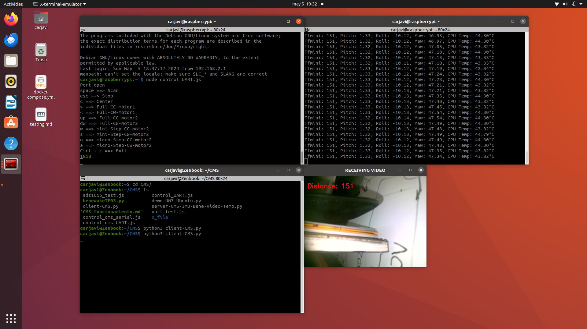
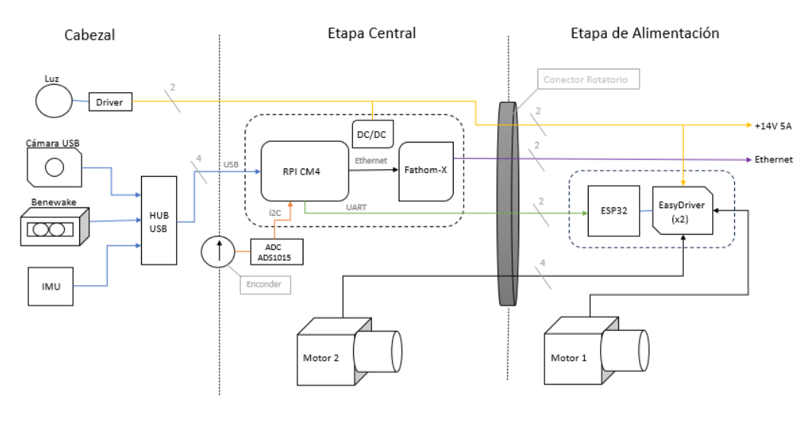
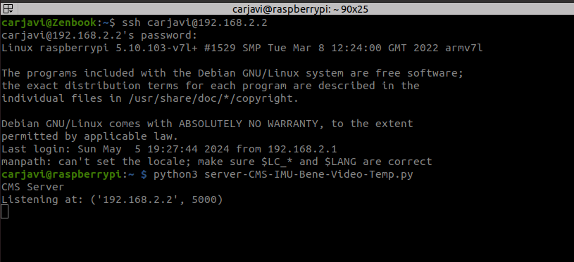
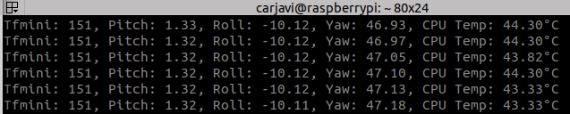
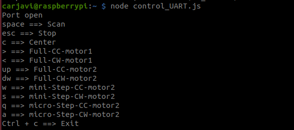
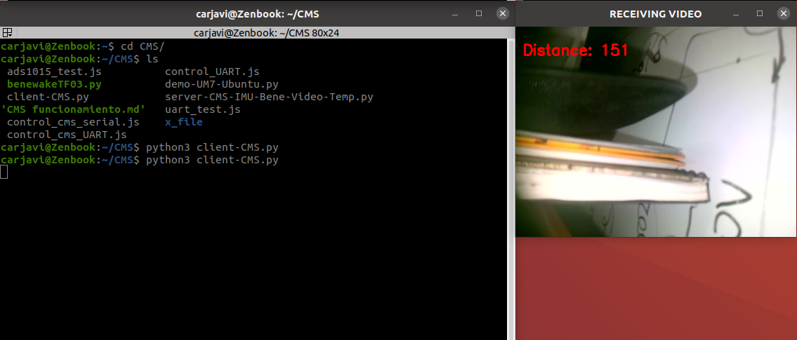

<p align="center"></p>
<h1 align="center"> cms-demo </h1> 
<h4 align="right">May 24</h4>


<br>

# Diagrama de Bloque del Circuito

<p align="center"></p>

El demo corre desde la Raspberry hay que entrar por SSH, la RPi tiene una IP fija: 192.168.2.2. Hay 2 archivos por correr en la raíz de la RPi: ```server-CMS-IMU-Bene-Video-Temp.py``` y ```control_UART.js```.

## Acceso SSH a la RPi
Usando caja de comunicación  Fathom-X Tether Interface (FXTI). Recordar que debe estar en la misma red para poder ingresar por SSH.
```
ssh carjavi@192.168.2.2
password: 268613
```

# Run Demo
## Transmisión de video mediante el server
```
python3 server-CMS-IMU-Bene-Video-Temp.py
```
Server esperando la conexion del cliente en la IP:192.168.2.2:5000.
<p align="center"></p>


<br>

Cuando entra el cliente comienza la lectura de la data. Solo se muestra, nada se almacena, esto es solo un demo.
<p align="center"></p>


<br>

Este corre el server que transmite el video de la cámara y la distancia del sensor benewake por medio de OpenCV usando UDP y el puerto 5000. también muestra los angulos Euler de la IMU  y la temperatura del procesador de la RPi. Este script está hecho en python. Con "ctrl + c " cerramos el server.

## Control del movimiento del CMS

```
node control_UART.js
```

<p align="center"></p>

Este corre un script en nodejs para el control del CMS, básicamente envía unos comandos al circuito del driver de los motores para controlar los movimientos básicos del CMS. Al correrlo se abrirá un pequeño menú que dirá las teclas que mueven el dispositivo. El circuito del driver esta en el puerto  ```"/dev/ttyS0" ``` a  ```115200 baudRate ``` y es un ESP32 mini, los driver de los motores son el EasyDriver v4.3 uno por cada motor. Con "ctrl + c " cerramos el la app de control.

## Comandos de control del ESP32 / EasyDriver por UART
El driver compuesto por el ESP32 y los EasyDriver admite basicamente estos comandos serialmente: <br>

| Comando     | Purpose                                         |
|-----------|-------------------------------------------------|
| `CW(*)`   | Mueve en dirección horario. |
| `CC(*)`   | Mueve en dirección anti horario. |
| `STP`   | Detiene todos los motores |
| `SCC`   | Mueve micro pasos en dirección horario.  |
| `SCW`   | Mueve micro pasos en dirección anti horario.  |
| `MCC`   | Mueve mini pasos en dirección horario.  |
| `MCW`   | Mueve mini pasos en dirección anti horario.  |

<br>

``` (*) ``` Es un numero que indica que motor es. 1 es el motor que contiene el conector rotatorio y puede girar 360 grados, y 2 el motor del brazo que solo puede moverse 90 grados. ejemplo "CC2" va hacer girar el motor del brazo en sentido anti horario hasta que se envié el comando de STOP o hasta que llegue a los 90 grados. el resto de los comandos se verán en el código fuente.

> :memo: **Note:** el motor 1 puede girar 360 grados sin problemas, mientras que el motor 2 (del brazo) solo 90 grados, automáticamente debería detenerse al llegar a 90 grados, o si se envía el comando  de STOP.
> 
> Solo es posible tener un valor numero del movimiento de brazo del CMS. por ello ese valor puede ser cambiado en el script de control, ese valor es ahora 1816 y es valor que da el convertidor ADC (analógico-digital) que lee el potenciómetro. este ADC  es un ADS1015 y esta conectado vía i2C a la RPi.

# Cliente del server UDP
## Run client
```
python3 cliente-CMS.py
```

<p align="center"></p>

Este scrip se corre en el computador externo para recibir el video y el valor de la distancia que está midiendo el sensor benewake, al correrlo se abre una ventana que muestra el video y dentro de ella el valor de distancia que mide el sensor. con "q" o "ctrl + c " cerramos el cliente.

# More information 
En el código fuente se podrá apreciar mejor las direcciones de los puertos USB de los sensores, la forma en que se obtuvieron los datos y el ejemplo de los comandos de control del CMS. las librerías y dependencias deben ser instaladas una a una, no hay un instalador.


## server-CMS-IMU-Bene-Video-Temp.py
```python
# This is server code to send video frames over UDP
import cv2, imutils, socket
import numpy as np
import base64

# Sensor TF03********************************************************
import serial.tools.list_ports
import time
import numpy as np
ser = serial.Serial()
ser.port = '/dev/ttyUSB1'
ser.baudrate = 115200

# CPU Temperature
import psutil

# IMU
from rsl_comm_py import UM7Serial
um7_serial = UM7Serial(port_name='/dev/ttyUSB2')

# Salida del bucle, cierre del socket puerto Serial ******************
try:
    if ser.is_open == False:
        try:
            ser.open()
        except:
            print('Open COM failed')
except KeyboardInterrupt:
    if ser != None:
        ser.close()
        server_socket.close()
    print('\nInterrupted, pressed ctrl-c button')
    
# measure_temp
def obtener_temperatura_procesador():
    # Obtener la temperatura del procesador en grados Celsius
    temperatura = psutil.sensors_temperatures().get('cpu_thermal')
    if temperatura:
        return temperatura[0].current
    else:
        return None

def calcular_promedio(datos):
    if not datos:
        return None
    return sum(datos) / len(datos)


# Se crea un socket UDP (socket.SOCK_DGRAM) y se configura su tamaño de búfer para manejar grandes cantidades de datos.
BUFF_SIZE = 65536
server_socket = socket.socket(socket.AF_INET,socket.SOCK_DGRAM)
server_socket.setsockopt(socket.SOL_SOCKET,socket.SO_RCVBUF,BUFF_SIZE)

# Asignación del host y el puerto
host_name = socket.gethostname()
host_ip = '192.168.2.2' # wifi: 192.168.1.100 / socket.gethostbyname(host_name)
print('CMS Server')#print(host_ip)
port = 5000 # 
socket_address = (host_ip,port)
server_socket.bind(socket_address)
print('Listening at:',socket_address)

# Inicialización de la captura de video
vid = cv2.VideoCapture(0) #  replace 'rocket.mp4' with 0 for webcam

fps,st,frames_to_count,cnt = (0,0,20,0)

# Bucle principal para recibir el mensaje de conexión y transmitir fotogramas de vídeo
datos_temp = [] # temperature
while True:
	
	# El servidor espera recibir un mensaje de conexión.
	msg,client_addr = server_socket.recvfrom(BUFF_SIZE)
	print('GOT connection from ',client_addr)
	WIDTH=400	

	# Bucle interno para transmitir fotogramas de video
	while(vid.isOpened()):
		_,frame = vid.read()
		frame = imutils.resize(frame,width=WIDTH)
		encoded,buffer = cv2.imencode('.jpg',frame,[cv2.IMWRITE_JPEG_QUALITY,80])
		
		# Codificar fotograma
		message = base64.b64encode(buffer)
		
		# Obtener datos del Sensor de distancia TFmini ***********************************
		count = ser.in_waiting
		if count > 8:
			recv = ser.read(9)
			ser.reset_input_buffer()
			if recv[0] == 0x59 and recv[1] == 0x59:
				distance = np.int16(recv[2] + np.int16(recv[3]<<8))
				tfmini = distance
				#print('distance = %5d' % (distance))
				ser.reset_input_buffer()

		else:
			time.sleep(0.050) # 50ms
   
		# Temperature 
		temperatura = obtener_temperatura_procesador()

		# Recibe el primer paquete de ángulos de Euler del sensor UM7
		packet = next(um7_serial.recv_euler_broadcast())
		# Accede a los atributos del paquete para obtener los valores de pitch, roll y yaw
		pitch = packet.pitch
		roll = packet.roll
		yaw = packet.yaw
  
  
		# Imprime los valores de pitch, roll y yaw
		print(f"Tfmini: {distance}, Pitch: {pitch:.2f}, Roll: {roll:.2f}, Yaw: {yaw:.2f}, CPU Temp: {temperatura:.2f}°C     ", end = "\r")
		
			
		# Enviar fotograma y Dato *********************************************************
		server_socket.sendto(message + b'|' + str(tfmini).encode(),client_addr)
		
		# ***** Anotar FPS y el Dato en el fotograma **************
		# frame = cv2.putText(frame,'FPS: '+str(fps),(10,40),cv2.FONT_HERSHEY_SIMPLEX,0.7,(0,0,255),2)
		# frame = cv2.putText(frame, 'Elapsed Time: ' + str(elapsed_time), (10, 80), cv2.FONT_HERSHEY_SIMPLEX, 0.7, (0, 0, 255), 2)
		# hace que se visualice el video en el server
		# cv2.imshow('TRANSMITTING VIDEO',frame)  #si no hay GUI debe estar desabilitada
		key = cv2.waitKey(1) & 0xFF
        
		
```
se instalaron las siguientes dependencias en la RPi:
		
```
sudo apt-get install python3-opencv -y // capture imagen
pip3 install imutils //  comunication socket
pip3 install sockets // comunication socket
pip3 install serial-tool // serail comunication 
pip3 install psutil // chequeo temperatura
		
```

## control_UART.js
```javascript
/**
 * Control Basico CMS
 */

//flags
var center_flag = "false";
var center = 1816;
var end_flag_Sup = "false"
var end_flag_Inf = "false"
var endSup = 2714;
var endInf = 934;

//ADC
var ads1x15 = require("node-ads1x15");
var chip = 0; //0 for ads1015, 1 for ads1115
var adc = new ads1x15(chip); //Simple usage (default ADS address on pi 2b or 3):
var channel = 0; //channel 0, 1, 2, or 3...
var samplesPerSecond = "250"; // see index.js for allowed values for your chip
var progGainAmp = "4096"; // see index.js for allowed values for your chip
var ADC;


// Serial
const { SerialPort } = require('serialport')
const { ReadlineParser } = require('@serialport/parser-readline')
const port = new SerialPort({ path: '/dev/ttyS0', baudRate: 115200 }) // /dev/ttyUSB1   /dev/ttyS0

const parser = port.pipe(new ReadlineParser())
//parser.on('data', console.log)

parser.on("data", (data) => {
 // var str = data.String(data);
  console.log("esp32: " ,data);
 // console.log("str: ",str);
});

port.on('open',function() {
  console.log('Port open');
  console.log('space ==> Scan');
  console.log('esc ==> Stop');
  console.log('c ==> Center');
  console.log('> ==> Full-CC-motor1');
  console.log('< ==> Full-CW-motor1');
  console.log('up ==> Full-CC-motor2');
  console.log('dw ==> Full-CW-motor2');
  console.log('w ==> mini-Step-CC-motor2');
  console.log('s ==> mini-Step-CW-motor2');
  console.log('q ==> micro-Step-CC-motor2');
  console.log('a ==> micro-Step-CW-motor2');
  console.log('Ctrl + c ==> Exit');
});

port.on("error", function(err) {
  console.log("Error: ", err.message);
});


var keypress = require('keypress');
 
// make `process.stdin` begin emitting "keypress" events
keypress(process.stdin);


// listen for the "keypress" event
process.stdin.on('keypress', function (ch, key) {
  //console.log('got "keypress"', key);
  if (key.ctrl && key.name == "c") {
    process.exit();
  }

  if (key.name == "right") {
    //console.log("right");
    port.write('CC1\n');
  }

  if (key.name == "left") {
    //console.log("left");
    port.write('CW1\n');
  }

  if (key.name == "up") {
    //console.log("up");
    end_flag_Inf = "true";
    port.write('CC2\n');
  }

  if (key.name == "down") {
    //console.log("down");
    end_flag_Sup = "true";
    port.write('CW2\n');
  }

  if (key.name == "escape") {
    //console.log("escape");
    port.write('stp\n');
  }

  if (key.name == "space") {
    //console.log("space");
    //port.write('ste\n');
    console.log(ADC);
  }

  if (key.name == "w" || key.name == "W") {
    if(ADC < endSup){
        port.write('MCW\n');
    }
  }

  if (key.name == "s" || key.name == "S") {
    if(ADC > endInf){
        port.write('MCC\n');
    }
  }

  if (key.name == "q" || key.name == "Q") {
    if(ADC < endSup){
        port.write('SCW\n');
    }
  }

  if (key.name == "a" || key.name == "A") {
    if(ADC > endInf){
        port.write('SCC\n');
    }
  }

  if (key.name == "c" || key.name == "C") {
    //ADC1015();
    center_flag = "true"; // 
    //end_flag_Sup = "true";
    //end_flag_Inf = "true"; // solo proteccion por si no detecta el centro

    if (ADC >= center+1){
        port.write('CC2\n');
    }
    if (ADC <= center-1){
        port.write('CW2\n');
    }
    
  }

});
 
process.stdin.setRawMode(true);
process.stdin.resume();


function ADC1015() { 
    if (!adc.busy) {
        adc.readADCSingleEnded(channel, progGainAmp, samplesPerSecond, function(err,data) {
            if (err) {
                throw err;
            }
            ADC = data;
            //console.log(ADC);
            // detiene el brazo en el centro
            if (center_flag == "true"){
                if((ADC > center-1) && (ADC < center+1)){
                    port.write('stp\n'); 
                    center_flag = "false"; 
                }
                // seguridad limites
                if(ADC > endSup){
                    port.write('stp\n');
                    center_flag = "false"; 
                }
                if(ADC < endInf){
                    port.write('stp\n');
                    center_flag = "false"; 
                }
            }
            // detiene los motores si llega a los limites del movimiento del brazo
            if(end_flag_Sup == "true"){
                if(ADC > endSup){
                    port.write('stp\n');
                    end_flag_Sup = "false";
                }
            }
            if (end_flag_Inf == "true"){
                if(ADC < endInf){
                    port.write('stp\n');
                    end_flag_Inf = "false";
                }
            }
        });
    }
}


setInterval(function() {
    ADC1015();
}, 10)


```
se instalaron las siguientes dependencias en la RPi:

```
npm i node-ads1x15
npm i serialport
npm i keypress
```

## cliente-CMS.py
```python
import cv2
import numpy as np
import socket
import base64

# Configurar el socket UDP
BUFF_SIZE = 65536
client_socket = socket.socket(socket.AF_INET, socket.SOCK_DGRAM)
client_socket.setsockopt(socket.SOL_SOCKET, socket.SO_RCVBUF, BUFF_SIZE)

# Conectar al servidor
host_ip = '192.168.1.89'  # Cambiar por la dirección IP del servidor
port = 5000
server_address = (host_ip, port)

# Envío de un mensaje de prueba al servidor
message = b'Hello'
client_socket.sendto(message, server_address)

# Inicializar ventana de visualización
cv2.namedWindow('RECEIVING VIDEO', cv2.WINDOW_NORMAL)

# Variables para el cálculo de FPS y contador
fps, st, frames_to_count, cnt = (0, 0, 20, 0)
counter_value = 0

# Bucle para recibir y mostrar el video
while True:
    # Recibir datos del servidor
    packet, _ = client_socket.recvfrom(BUFF_SIZE)
    
    # Decodificar el paquete desde base64
    data = packet.split(b'|')
    frame_data = data[0]
    distance_value = int(data[1])
    
    # Decodificar la imagen utilizando cv2.imdecode
    frame = base64.b64decode(frame_data)
    npdata = np.frombuffer(frame, dtype=np.uint8)
    frame = cv2.imdecode(npdata, 1)
    
    # Anotar el valor de la Distancia en el fotograma
    frame = cv2.putText(frame, 'Distance: ' + str(distance_value), (10, 40), cv2.FONT_HERSHEY_SIMPLEX, 0.7, (0, 0, 255), 2)
    
    # Mostrar el fotograma
    cv2.imshow("RECEIVING VIDEO", frame)
    key = cv2.waitKey(1) & 0xFF
    
    # Salir del bucle con la tecla 'q'
    if key == ord('q'):
        cv2.destroyAllWindows()
        client_socket.close()
        break

```

deben instalarse las siguientes dependencias en el computador externo:
		
```
sudo apt-get install python3-opencv -y // capture imagen
pip3 install imutils //  comunication socket
pip3 install sockets // comunication socket
pip3 install serial-tool // serail comunication 
pip3 install psutil // chequeo temperatura
		
```

## ESP32 code (driver de los motores)
```c++

//Declare variables for functions
int x;
String dataUART;
int sec = 1;
int scan_step = 10;

//Declare pin functions on EasyDriver
const int dir1 = 17; // direction
const int stp1 = 16; // steps
const int EN1 = 4; // Enable HIGH (disabled) / LOW(enabled)
const int dir2 = 23; // direction
const int stp2 = 19; // steps
const int EN2 = 34; // Enable HIGH (disabled) / LOW(enabled)


void setup() {
  Serial.begin(115200); // Configura la velocidad de baudios para la comunicación serial USB (para depuración)
  pinMode(stp1, OUTPUT);
  pinMode(dir1, OUTPUT);
  pinMode(EN1, OUTPUT);
  pinMode(stp2, OUTPUT);
  pinMode(dir2, OUTPUT);
  pinMode(EN2, OUTPUT);
  Serial.println("Ready...");
  DisableMotores();
}

void loop() {
   // Leer desde el puerto serial USB (para depuración)
  if (Serial.available()) {
    dataUART = Serial.readStringUntil('\n');
    //Serial.println(dataUART);
        
    if (dataUART.equals("stp")){
      //Serial.println("stop");
      DisableMotores();
      dataUART = "";
    }
    if (dataUART == "ste"){
      //Serial.println("step");
      dataUART = "";
    }
    if (dataUART == "SCC"){
      SCC();
    }
    if (dataUART == "SCW"){
      SCW();
    }
    if (dataUART == "MCC"){
      MCC();
    }
    if (dataUART == "MCW"){
      MCW();
    }

    String turn = dataUART.substring(0,2);
    String motor = dataUART.substring(2,dataUART.length());
    /*
        Serial.print("Giro:");
        Serial.println(turn);
        Serial.print("Motor:");
        Serial.println(motor);
     */
    if (turn=="CC" || turn=="CW"){
 
        if(turn=="CC" && motor == "1"){
            digitalWrite(EN1, LOW);
            digitalWrite(dir1, LOW);
            while(!dataUART.equals("stp")){
                  digitalWrite(stp1,HIGH); //Trigger one step ForwardReverse
                  delay(sec);
                  digitalWrite(stp1,LOW); //Pull step pin low so it can be triggered again
                  delay(sec);
                  while (Serial.available() > 0) {
                    dataUART = Serial.readStringUntil('\n');
                    if (dataUART == "SCC"){SCC();}
                    if (dataUART == "SCW"){SCW();}
                  }
            }
            DisableMotores();
        }
        
        if(turn=="CW" && motor == "1"){
            digitalWrite(EN1, LOW);
            digitalWrite(dir1, HIGH);
            while(!dataUART.equals("stp")){
                  digitalWrite(stp1,HIGH); //Trigger one step ForwardReverse
                  delay(sec);
                  digitalWrite(stp1,LOW); //Pull step pin low so it can be triggered again
                  delay(sec);
                  while (Serial.available() > 0) {
                    dataUART = Serial.readStringUntil('\n');
                    if (dataUART == "SCC"){SCC();}
                    if (dataUART == "SCW"){SCW();}
                  }
            }
            DisableMotores();
        }

        if(turn=="CC" && motor == "2"){
            digitalWrite(EN2, LOW);
            digitalWrite(dir2, LOW);
            while(!dataUART.equals("stp")){
                  digitalWrite(stp2,HIGH); //Trigger one step ForwardReverse
                  delay(sec);
                  digitalWrite(stp2,LOW); //Pull step pin low so it can be triggered again
                  delay(sec);
                  while (Serial.available() > 0) {
                    dataUART = Serial.readStringUntil('\n');
                  }
            }
            DisableMotores();
        }
        
        if(turn=="CW" && motor == "2"){
            digitalWrite(EN2, LOW);
            digitalWrite(dir2, HIGH);
            while(!dataUART.equals("stp")){
                  digitalWrite(stp2,HIGH); //Trigger one step ForwardReverse
                  delay(sec);
                  digitalWrite(stp2,LOW); //Pull step pin low so it can be triggered again
                  delay(sec);
                  while (Serial.available() > 0) {
                    dataUART = Serial.readStringUntil('\n');
                  }
            }
            DisableMotores();
        }

        
        dataUART = "";
    }

    

    dataUART = "";

  }
}


void MCC()
{
    digitalWrite(EN2, LOW);
    digitalWrite(dir2, LOW);
    for(x= 0; x<100; x++){
        digitalWrite(stp2,HIGH); //Trigger one step forward
        delay(sec);
        digitalWrite(stp2,LOW); //Pull step pin low so it can be triggered again
        delay(sec);
    }
    digitalWrite(EN2, HIGH);
}

void MCW()
{
    digitalWrite(EN2, LOW);
    digitalWrite(dir2, HIGH);
    for(x= 0; x<100; x++){
        digitalWrite(stp2,HIGH); //Trigger one step forward
        delay(sec);
        digitalWrite(stp2,LOW); //Pull step pin low so it can be triggered again
        delay(sec);
    }
    digitalWrite(EN2, HIGH);
}

void SCC()
{
    digitalWrite(EN2, LOW);
    digitalWrite(dir2, LOW);
    for(x= 0; x<scan_step; x++){
        digitalWrite(stp2,HIGH); //Trigger one step forward
        delay(sec);
        digitalWrite(stp2,LOW); //Pull step pin low so it can be triggered again
        delay(sec);
    }
    digitalWrite(EN2, HIGH);
}

void SCW()
{
    digitalWrite(EN2, LOW);
    digitalWrite(dir2, HIGH);
    for(x= 0; x<scan_step; x++){
        digitalWrite(stp2,HIGH); //Trigger one step forward
        delay(sec);
        digitalWrite(stp2,LOW); //Pull step pin low so it can be triggered again
        delay(sec);
    }
    digitalWrite(EN2, HIGH);
}


void DisableMotores()
{
  digitalWrite(stp1, LOW);
  digitalWrite(dir1, LOW);
  digitalWrite(EN1, HIGH);
  digitalWrite(stp2, LOW);
  digitalWrite(dir2, LOW);
  digitalWrite(EN2, HIGH);
}

```

# Observations

* La RPi posee un disipador de calor pequeño y un ventilador que permite tener una temperatura estable de trabajo no mayor a 52 grados centígrados, por largas horas de uso. Pudiendo soportar casi 20 grados centígrados más en uso real antes de fallar.
* Para futuras mejoras se podría agregar un enconder o sensor de movimiento al motor 1 que contiene todo el cuerpo del equipo el cual gira 360 grados.
* El equipo necesitara sensores de distancia que permitan verificar cuando el equipo pueda moverse dentro de la cavidad sin chocar con el ambiente que le rodea.
* Es posible agregar un sensor que permita medir la corriente del equipo en caso de un atascamiento del mismo que no permita el movimiento o funcionamiento normal del equipo.
* Para conectarse vía SSH a la computadora del CMS es requerido una caja de comunicación  Fathom-X Tether Interface (FXTI). Lo que nos permite usar un cable coaxial de hasta 1km de largo.
* El dispositivo CMS puede operar a 12V / 2A para las pruebas, pero lo ideal es usar 14V / 5A para mayor desempeño de los motores.


<br>

---
Copyright &copy; 2022 [carjavi](https://github.com/carjavi). <br>
```www.instintodigital.net``` <br>
carjavi@hotmail.com <br>
<p align="center">
    <a href="https://instintodigital.net/" target="_blank"></a>
</p>


